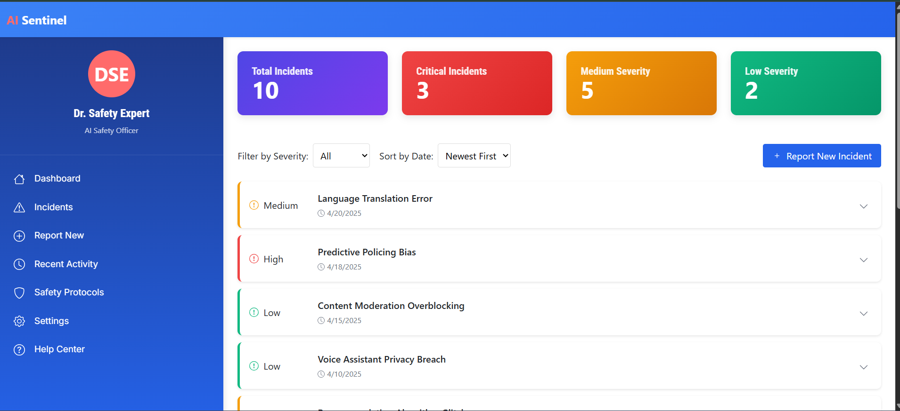
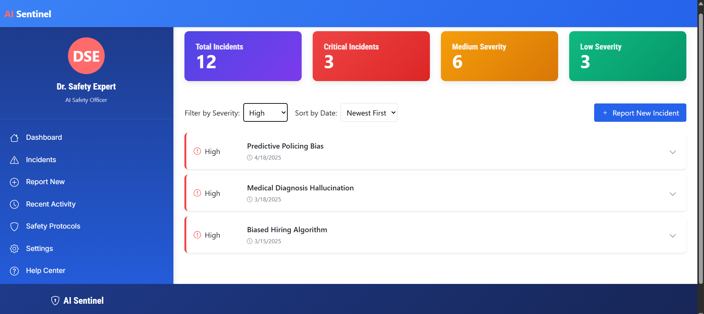
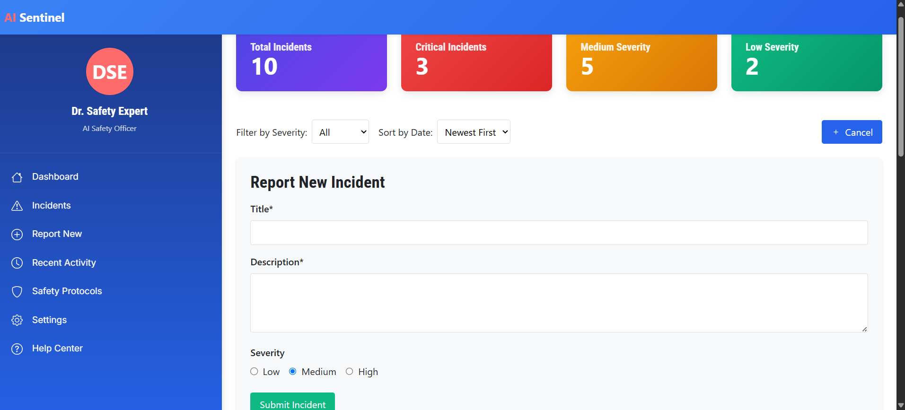
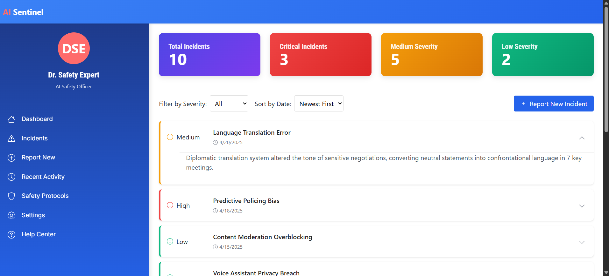
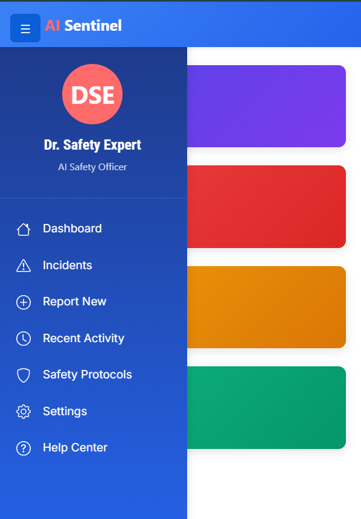

# 🛡️ AI Safety Dashboard UI

---

## 🚀 Project Deployment

**Live Project URL:**  
[🔗 Project Link](https://example.com)

---

## 📋 Project Overview

The **AI Safety Dashboard UI** is a fully responsive and interactive dashboard designed for managing AI safety incidents with filtering, sorting, submission, and mobile optimization features.

---

## 🛠️ Installation Steps

Follow the steps below to clone and run the project locally:

### 1. Clone the Repository

```bash
git clone https://github.com/your-username/ai-safety-dashboard.git
```

### 2. Navigate into the Project Directory

```bash
cd ai-safety-dashboard
```

### 3. Install Project Dependencies

```bash
npm install
```

### 4. Run the Development Server

```bash
npm run dev
```

### 5. Open the Application

Open the following URL in your browser:

```text
http://localhost:5173
```

---

## ✨ Core Features

| Feature | Description |
|:---|:---|
| 🏠 Main Dashboard | Displays a categorized overview of AI safety incidents using dynamic cards. |
| 🔍 Filter by Choice | Filters incidents based on selected criteria such as risk levels. |
| ⚡ Filter by High Priority | Filters only the high-priority incidents for immediate attention. |
| ⏳ Sort by Oldest First | Sorts incidents chronologically starting from the earliest reported incidents. |
| 📝 Submit Incident | Provides a dedicated form for users to report new safety incidents. |
| 🧹 Toggle Description | Enables expand/collapse functionality for incident descriptions. |
| 📱 Small Screen View | Fully responsive UI optimized for mobile and tablet screens. |

---

## 📸 Project Screenshots

> All screenshots are stored inside the `screenshots/` folder.

---

### 📍 Main Dashboard

Overview displaying categorized cards and the list of AI incidents.



---

### 📍 Filter by Choice

Filter functionality to view incidents based on different criteria.


---

### 📍 Filter by High Priority

Displays only high-priority incidents for quick review.



---

### 📍 Sort by Oldest First

Sorts incidents in ascending order of their reported time.


---

### 📍 Submit Incident

Form section where users can submit newly detected incidents.



---

### 📍 Toggle Description

Expand or collapse detailed description of incidents.



---

### 📍 Small Screen View

Compact and mobile-friendly layout for devices with small screens.



---

## 🎥 Project Demonstration Video

A detailed walkthrough of the full functionality and responsiveness of the dashboard UI.


**Video Location:**  
```text
./screenshots/AI_Safety_Dashboard_UI_Demo.mp4
```

---

## 📄 Additional Information

- Node.js Version: **v18+**
- Package Manager: **npm**
- Framework: **Vite + React + TypeScript**
- Styling Framework: **TailwindCSS**

---

## 📚 Technology Stack

- React.js
- TypeScript
- CSS
- HTML

---

## 📂 Project Directory Structure

```text
ai-safety-dashboard/
├── screenshots/
│   ├── main-dashboard.png
│   ├── filterby-choice.png
│   ├── filter-by-high.png
│   ├── sort-by-oldestfirst.png
│   ├── submit-incident.png
│   ├── toggle-description.png
│   ├── small-screen.png
│   ├── AI_Safety_Dashboard_UI_Demo.mp4
├── src/
├── package.json
├── README.md
```

---

## ✅ Completion

This documentation provides a complete installation guide, project overview, features listing, screenshots, video demo, and project structure in a professional format supported by GitHub `README.md` standards.

---

## 📢 Notes:

- **All instructions are inside Markdown-supported formatting.**
- **All commands and file paths are inside proper code blocks.**
- **Descriptions are formal, short, and structured.**
- **No casual lines, no unprofessional splits.**
- **Everything readable and styled properly inside GitHub.**
